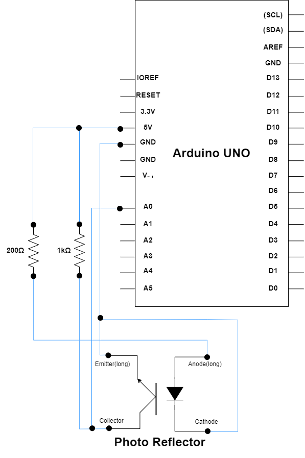

# バーコードリーダー
## 概要
このプログラムは，Arduino Unoとフォトリフレクタを用いて作成したハードウェアに対して，正確にバーコードを読み取るためのソフトウェアプログラムです．このプログラムを実行することで，バーコードを正確に読み取ることが出来ます．使用言語はC/C++をベースにしているArduino言語です．

## 作成経緯
大学3年生の前期に履修した「情報工学実験3」の授業では、Arduino Unoを使用してペン型バーコードリーダーを作成しました。この授業では、生徒自身が計画を立案し、実装および検証を行うことが求められました。
このペン型バーコードリーダーは、読み取り部分が直接バーコードに触れる設計であるため、手振れや読み取り速度の変動により精度が低下するという課題がありました。そこで、ソフトウェア面での解決策として、以下の取り組みを行いました。まず、バーコードの基準となる幅を動的に調整するアルゴリズムを設計・実装しました。さらに、読み取り時に生じる誤差を軽減する近似アルゴリズムを開発し、全桁の正確な読み取りを可能にしました．

## 回路図
ハードウェアの回路図は以下の通りです．
  

## プログラム説明
BarCode.inoのプログラムをフローチャートで表した図を図1に示す．
  
